# otter.nvim

Just ask an otter! 🦦

> [!NOTE]
> Otter has grown up! It is now a language server-client combo,
> which means you don't have to configure keybindings for it.
> Just call `otter.activate()`!
> 
> If you previously used e.g. `otter.ask_hover()`, you now just use the normal
> lsp request functions like `vim.lsp.buf.hover()` and the otters take it from there.
> If you previously used the `otter` `nvim-cmp` source, you can remove it,
> as the completion results now come directly via the `cmp-nvim-lsp` source
> together with other language servers.
> If you want to stick to the old way, you have to pin the version to `v1.15.1`.

## What is otter.nvim?

**tldr: Otter.nvim provides lsp features and a code completion source for code embedded in other documents**


Demo

https://user-images.githubusercontent.com/17450586/209436156-f7f42ea9-471c-478a-868e-77517d71a1c5.mp4

When implementing autocompletion, code diagnostics and the likes for [quarto-nvim](https://github.com/quarto-dev/quarto-nvim) I realized that a core feature would be useful to other plugins and usecases as well.
[quarto](https://quarto.org) documents are computational notebooks for scientific communication based on [pandoc](https://pandoc.org/)s markdown.
One key feature is that these `qmd` documents can contain exectuable code blocks, with possibly different languages such as `R` and `python` mixed in one document.

How do we get all the cool language features we get for a pure e.g. `python` file -- like code completion, documentation hover windows, diagnostics -- when the code is just embedded as code blocks in a document?
Well, if one document can't give us the answer, we ask an otter (another)!
`otter.nvim` creates and synchronizes hidden buffers containing a single language each and directs requests for completion and other lsp requests from the main buffer to those other buffers (otter buffers).

Example in a markdown (or quarto markdown) document `index.md`:

````
# Some markdown
Hello world

```python
import numpy as np
np.zeros(10)
```
````

We create a hidden buffer for a file `index.md.tmp.py`


````
 
 
 
 
import numpy as np
np.zeros(10)

````

This contains just the python code and blank lines for all other lines (this keeps line numbers the same, which comes straight from the trick that the quarto dev team uses for the vs code extension as well).
Language servers can then attach to this hidden buffer.
We can do this for all embedded languages found in a document.

### A group of otters is called a raft

Each otter-activated buffer can maintain a set of other buffers synchronized to the main buffer.

> In other words, each buffer can have a raft of otters!

The otter keeper looks after the otters associated with each main buffer
to keep them in sync:

```mermaid
stateDiagram-v2
Main --> otterkeeper
otterkeeper --> 🦦1
otterkeeper --> 🦦2
otterkeeper --> 🦦3
```



The otter language server directs lsp requests to the main
buffer to the otter responsible for the language of the
current code section.
It modifies the parameters accordingly e.g. to change the
uri of the file of which a position is requested.
If does so both ways, first with the request and then
when handling the request.
Once the response has been properly modifed it is passed on
to be handled by Neovim's default handlers `vim.lsp.handlers[<...>]`
or the user-supplied handler in `vim.lsp.buf_request_all`.

```mermaid
stateDiagram-v2
otterls : otter-ls
params : modified request params
ls : ls attached to otter buffer 🦦1
handler: otter-ls handler
defaultHandler: default handler of nvim
request --> otterls
otterls --> params
params --> ls
ls --> response
response --> handler
handler --> defaultHandler
```



## How do I use otter.nvim?

### Dependencies

`otter.nvim` requires the following plugins:

```lua
{
  'nvim-treesitter/nvim-treesitter'
}
```

and the latest [Neovim stable version](https://github.com/neovim/neovim/releases/tag/stable) (>= `v0.10.0`).

### Minimal lazy.nvim spec:

```lua
{
    'jmbuhr/otter.nvim',
    dependencies = {
      'nvim-treesitter/nvim-treesitter',
    },
    opts = {},
}
```

### Configure otter

If you want to use the default config below you don't need to call `setup`.

```lua
local otter = require'otter'
otter.setup{
  lsp = {
    -- `:h events` that cause the diagnostics to update. Set to:
    -- { "BufWritePost", "InsertLeave", "TextChanged" } for less performant
    -- but more instant diagnostic updates
    diagnostic_update_events = { "BufWritePost" },
    -- function to find the root dir where the otter-ls is started
    root_dir = function(_, bufnr)
      return vim.fs.root(bufnr or 0, {
        ".git",
        "_quarto.yml",
        "package.json",
      }) or vim.fn.getcwd(0)
    end,
  },
  -- options related to the otter buffers
  buffers = {
    -- if set to true, the filetype of the otterbuffers will be set.
    -- otherwise only the autocommand of lspconfig that attaches
    -- the language server will be executed without setting the filetype
    --- this setting is deprecated and will default to true in the future
    set_filetype = true,
    -- write <path>.otter.<embedded language extension> files
    -- to disk on save of main buffer.
    -- usefule for some linters that require actual files.
    -- otter files are deleted on quit or main buffer close
    write_to_disk = false,
    -- a table of preambles for each language. The key is the language and the value is a table of strings that will be written to the otter buffer starting on the first line.
    preambles = {},
    -- a table of postambles for each language. The key is the language and the value is a table of strings that will be written to the end of the otter buffer.
    postambles = {},
    -- A table of patterns to ignore for each language. The key is the language and the value is a lua match pattern to ignore.
    -- lua patterns: https://www.lua.org/pil/20.2.html
    ignore_pattern = {
      -- ipython cell magic (lines starting with %) and shell commands (lines starting with !)
      python = "^(%s*[%%!].*)",
    },
  },
  -- list of characters that should be stripped from the beginning and end of the code chunks
  strip_wrapping_quote_characters = { "'", '"', "`" },
  -- remove whitespace from the beginning of the code chunks when writing to the ottter buffers
  -- and calculate it back in when handling lsp requests
  handle_leading_whitespace = true,
  -- mapping of filetypes to extensions for those not already included in otter.tools.extensions
  -- e.g. ["bash"] = "sh"
  extensions = {
  },
  -- add event listeners for LSP events for debugging
  debug = false,
  verbose = { -- set to false to disable all verbose messages
    no_code_found = false -- warn if otter.activate is called, but no injected code was found
  },
}
```

### Activate otter

Activate otter for the current document with `otter.activate()`

```lua
--- Activate the current buffer by adding and synchronizing
---@param languages table|nil List of languages to activate. If nil, all available languages will be activated.
---@param completion boolean|nil Enable completion for otter buffers. Default: true
---@param diagnostics boolean|nil Enable diagnostics for otter buffers. Default: true
---@param tsquery string|nil Explicitly provide a treesitter query. If nil, the injections query for the current filetyepe will be used. See :h treesitter-language-injections.
otter.activate(languages, completion, diagnostics, tsquery)
```

### Use otter

Use your normal lsp keybindings for e.g. `vim.lsp.buf.hover`, `vim.lsp.buf.references` etc.

#### LSP Methods currently implemented

| Method | `nvim.lsp.buf.<function>` |
| ------------- | ---- |
| textDocument/hover             | `hover`                           |
| textDocument/signatureHelp     | `signature_help`                  |
| textDocument/definition        | `definition`                      |
| textDocument/implementation    | `implementation`                  |
| textDocument/declaration       | `declaration`                     |
| textDocument/documentSymbol    | `document_symbol`                 |
| textDocument/typeDefinition    | `type_definition`                 |
| textDocument/rename            | `rename`                          |
| textDocument/references        | `references`                      |
| textDocument/completion        | `completion`                      |


#### Additional functions

```lua
-- Export the raft of otters as files.
-- Asks for filename for each language.
otter.export()
otter.export_otter_as()
```

## Current limitations

- Otter-ls currently runs only in single file mode. So while the language servers associated with
  each otter can know about a complete project, only one notebook is looked at by one instance of otter-ls.
  This means, you can e.g. rename a python variable across a bunch of modules directly from a quarto notebook
  managed by otter.nvim, but this (currently) won't automatically affect the same variable should used in a different notebook.
- Likewise, the other language servers don't know they are being fed by the otter-ls and otter.nvim doesn't hear about
  things that happen directly with the other language server.
  In a similar example as above: If I send a rename request while in a quarto file it is handled by otter-ls and
  properly passed on to pyright in a modified form. The variable gets rename in the qmd file and in all python files
  of the project. However, if I send the request while in a python file it get's handled directly by pyright.
  Otter-ls never hears of this, so the variable stays as it is in the qmd file.
- Diagnostics are handled via an autocommand instead of lsp requests to otter-ls for now,
  because they don't require the cursor to be in an otter context. Could be solved more elegantly in the future.
- Formatting requests are tricky. But formatting is handled very well by [conform.nvim](https://github.com/stevearc/conform.nvim)
  also for injected code via their `injected` formatter
  (example from my config: [link](https://github.com/jmbuhr/quarto-nvim-kickstarter/blob/382b050e13eada7180ad048842386be37e820660/lua/plugins/editing.lua#L29-L81)).

## Extend or build on otter.nvim

Additional information can be passed to the `otter-ls` via the `params` of an lsp request.
Those are grouped under the `params.otter` key.
Currently available parameters with examples:

### `params.otter.lang`

By default, otter-ls forwards your request to the otter responsible for the language
determined by the position of your cursor.
However, you may want to specify the language manually.
For this we expose `params.otter.lang`.
For example, this is how you can request the document symbols for a specific language,
regardless of if your cursor is currently in a code chunk of that language:

```lua
local ms = vim.lsp.protocol.Methods
local function get_otter_symbols_lang()
  local otterkeeper = require'otter.keeper'
  local main_nr = vim.api.nvim_get_current_buf()
  local langs = {}
  for i,l in ipairs(otterkeeper.rafts[main_nr].languages) do
    langs[i] = i .. ': ' .. l
  end
  -- promt to choose one of langs
  local i = vim.fn.inputlist(langs)
  local lang = otterkeeper.rafts[main_nr].languages[i]
  local params = {
    textDocument = vim.lsp.util.make_text_document_params(),
    otter = {
      lang = lang
    }
  }
  -- don't pass a handler, as we want otter to use its own handlers
  vim.lsp.buf_request(main_nr, ms.textDocument_documentSymbol, params, nil)
end

vim.keymap.set("n", "<leader>os", get_otter_symbols_lang, {desc = "otter [s]ymbols"})
```

To explicitly request only from the `otter-ls` and avoid other language servers jumping in,
replace the last line of the function with:

```lua
  local clients = vim.lsp.get_clients({
      -- the client is always named otter-ls[<buffnr>]
      name = 'otter-ls'.. '[' .. main_nr .. ']'
  })
  if #clients == 1 then
    local otter_client = clients[1]
    otter_client.request(ms.textDocument_documentSymbol, params, nil)
  end
```

