# otter.nvim

Just ask an otter! 🦦

## What is otter.nvim?

**tldr: Otter.nvim provides lsp features and a code completion source for code embedded in other documents**

Demo

https://user-images.githubusercontent.com/17450586/209436156-f7f42ea9-471c-478a-868e-77517d71a1c5.mp4

When implementing autocompletion, code diagnostics and the likes for [quarto-nvim](https://github.com/quarto-dev/quarto-nvim) I realized that a core feature would be useful to other plugins and usecases as well.
[quarto](https://quarto.org) documents are computational notebooks for scientific communication based on [pandoc](https://pandoc.org/)s markdown.
One key feature is that these `qmd` documents can contain exectuable code blocks, with possibly different languages such as `R` and `python` mixed in one document.

How do we get all the cool language features we get for a pure e.g. `python` file -- like code completion, documentation hover windows, diagnostics -- when the code is just embedded as code blocks in a document?
Well, if one document can't give us the answer, we ask an otter (another)!
`otter.nvim` creates and synchronizes hidden buffers containing a single language each and directs requests for completion and lsp requests from the main buffer to those other buffers (otter buffers).

Example in a markdown (or quarto markdown) document `index.md`:

````
# Some markdown

Hello world

```python
import numpy as np
np.zeros(10)
```
````

We create a hidden buffer for a file `index.md.tmp.py`


````
 
 
 
 
  import numpy as np
  np.zeros(10)
````

This contains just the python code and blank lines for all other lines (this keeps line numbers the same, which comes straight from the trick that the quarto dev team uses for the vs code extension as well).
Language servers can then attach to this hidden buffer.
We can do this for all embedded languages found in a document.

### A group of otters is called a raft

Each otter-activated buffer can maintain a set of other buffers synchronized to the main buffer.

> In other words, each buffer can have a raft of otters!

`otter.nvim` contains a completion source for [nvim-cmp](https://github.com/hrsh7th/cmp-nvim-lua).
When a completion request is made, the whole raft of otters is synchronized and the question is directed to the otters.
The accumulated answers are then displayed in the main buffer.

```mermaid
stateDiagram-v2
    Main --> 🦦1
    Main --> 🦦2
    Main --> 🦦3
    🦦1 --> response
    🦦2 --> response
    🦦3 --> response
    response --> Main: filter
```



## How do I use otter.nvim?

The easiest way to get started is try it out in [quarto-nvim](https://github.com/quarto-dev/quarto-nvim) or look at the usecases there.
If you want to integrate `otter.nvim` in your own plugin or nvim config, check out the documentation at `:h otter` in nvim
or this `README.md` file.

If you call `require'otter'.dev_setup()` in your nvim configuration you will even see
code completion and documentation windows for the lua chunks in this readme!

`otter.nvim` provides these user-facing functions:

```lua
otter = require'otter'
otter.activate_otters(languages, completion)
otter.sync_raft(main_nr)
otter.send_request(main_nr, request, filter)
```


