# otter.nvim

Just ask an otter! 🦦

## What is otter.nvim?

**tldr: Otter.nvim provides lsp features and a code completion source for code embedded in other documents**

Demo

https://user-images.githubusercontent.com/17450586/209436156-f7f42ea9-471c-478a-868e-77517d71a1c5.mp4

When implementing autocompletion, code diagnostics and the likes for [quarto-nvim](https://github.com/quarto-dev/quarto-nvim) I realized that a core feature would be useful to other plugins and usecases as well.
[quarto](https://quarto.org) documents are computational notebooks for scientific communication based on [pandoc](https://pandoc.org/)s markdown.
One key feature is that these `qmd` documents can contain exectuable code blocks, with possibly different languages such as `R` and `python` mixed in one document.

How do we get all the cool language features we get for a pure e.g. `python` file -- like code completion, documentation hover windows, diagnostics -- when the code is just embedded as code blocks in a document?
Well, if one document can't give us the answer, we ask an otter (another)!
`otter.nvim` creates and synchronizes hidden buffers containing a single language each and directs requests for completion and lsp requests from the main buffer to those other buffers (otter buffers).

Example in a markdown (or quarto markdown) document `index.md`:

````
# Some markdown

Hello world

```python
import numpy as np
np.zeros(10)
```
````

We create a hidden buffer for a file `index.md.tmp.py`


````
 
 
 
 
  import numpy as np
  np.zeros(10)
````

This contains just the python code and blank lines for all other lines (this keeps line numbers the same, which comes straight from the trick that the quarto dev team uses for the vs code extension as well).
Language servers can then attach to this hidden buffer.
We can do this for all embedded languages found in a document.

### A group of otters is called a raft

Each otter-activated buffer can maintain a set of other buffers synchronized to the main buffer.

> In other words, each buffer can have a raft of otters!

`otter.nvim` contains a completion source for [nvim-cmp](https://github.com/hrsh7th/cmp-nvim-lua).
When a completion request is made, the whole raft of otters is synchronized and the question is directed to the otters.
The accumulated answers are then displayed in the main buffer.

```mermaid
stateDiagram-v2
    Main --> 🦦1
    Main --> 🦦2
    Main --> 🦦3
    🦦1 --> response
    🦦2 --> response
    🦦3 --> response
    response --> Main: filter
```



## How do I use otter.nvim?

The easiest way to get started is try it out in [quarto-nvim](https://github.com/quarto-dev/quarto-nvim) or look at the usecases there.
Specifically, you'll want to look at the `lua/plugins/quarto.lua` file
in the [quarto-nvim-kickstarter](https://github.com/jmbuhr/quarto-nvim-kickstarter)
configuration.

In short:

### Configure otter

If you want to use the default config below you don't need to call `setup`.

```lua
local otter = requir'otter'
otter.setup{
  lsp = {
    hover = {
      border = { "╭", "─", "╮", "│", "╯", "─", "╰", "│" },
    },
  },
  buffers = {
    -- if set to true, the filetype of the otterbuffers will be set.
    -- otherwise only the autocommand of lspconfig that attaches
    -- the language server will be executed without setting the filetype
    set_filetype = false,
  },
  strip_wrapping_quote_characters = { "'", '"', "`" },
}
```

### Configure autocompletion

Apart from its own functions, `otter.nvim` comes with a completion source for `nvim-cmp` for
the embedded code. Use it as follows:

```lua
local cmp = require'cmp'
cmp.setup(
    -- <rest of your nvim-cmp config>
    sources = {
        { name = "otter" },
        -- <other sources>
    }
}
```


### Activate otter

Activate otter for the current document with

```lua
-- table of embedded languages to look for.
-- required (no default)
local languages = {'python', 'lua' }

-- enable completion/diagnostics
-- defaults are true
local completion = true
local diagnostics = true
-- treesitter query to look for embedded languages
-- uses injections if nil or not set
local tsquery = nil

otter.activate(languages, completion, diagnostics, tsquery)
```

### Use otter

Assuming `otter.nvim` is configured and added to `nvim-cmp` as a completion source,
call `require'otter'.activate({'python', 'r', <more languages you want to embed> })` on any
buffer that has injections (see `:h treesitter-language-injections`) defined
and you will see code completion and diagnostics (on save).

Then use the `otter.ask_...` functions to e.g. ask for hover documentation, references or the definition.

`otter.ask_` functions fall back to regular lsp requests on the main buffer when not in an otter context.
Currently implemented functions are:

```lua
otter.ask_definition()
otter.ask_type_definition()
otter.ask_hover()
otter.ask_references()
otter.ask_document_symbols()
otter.ask_rename()
otter.ask_format()
```

Additional functions:

```lua
-- Export the raft of otters as files.
-- Asks for filename for each language.
otter.export()
otter.export_otter_as()
```


### Dependencies

`otter.nvim` requires the following plugins:

```lua
{
  'hrsh7th/nvim-cmp', -- optional, for completion
  'neovim/nvim-lspconfig',
  'nvim-treesitter/nvim-treesitter'
}
```


